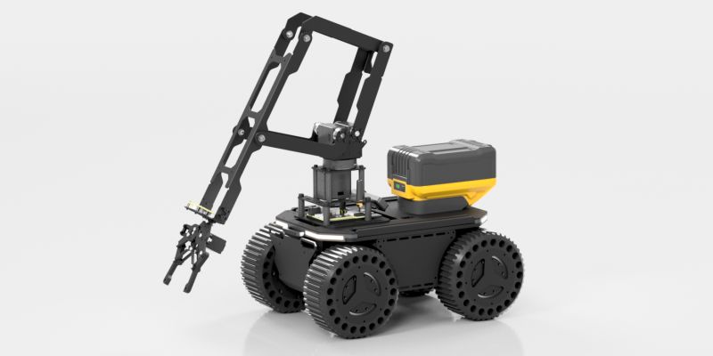

# LinkArm CLI SDK

A Python command-line tool and SDK for controlling the **LinkArm robotic arm**.

This project provides:

- A **CLI interface** for end users
- A **Python library API** for developers
- A **standardized control entry** for AI / Agents
- A **quick start guide** for beginners

Suitable for:

- Modular debugging
- Educational demonstrations
- Automation scripts
- Raspberry Pi / Jetson robot integration
- AI models or agent-based robotic arm control



---

## Table of Contents

- [Overview](#overview)
- [Features](#features)
- [System Architecture](#system-architecture)
- [Hardware & Power](#hardware--power)
- [Wiring for Different Models](#wiring-for-different-models)
- [Environment Setup](#environment-setup)
- [First-Time Connection](#first-time-connection)
- [Find Serial Port & Edit Config](#find-serial-port--edit-config)
- [Servo Center Calibration (Critical)](#servo-center-calibration-critical)
- [Quick Start](#quick-start)
- [Configuration Example](#configuration-example)
- [CLI Command Overview](#cli-command-overview)
- [CLI Command Details](#cli-command-details)
- [Interactive Shell Mode](#interactive-shell-mode)
- [AI & Automation Usage](#ai--automation-usage)
- [Using Python SDK](#using-python-sdk)
- [Multi-Arm Control](#multi-arm-control)
- [Platform Setup](#platform-setup)
- [Calibration Sticker Example](#calibration-sticker-example)
- [Minimal Examples](#minimal-examples)
- [FAQ](#faq)

---

## Overview

`linkarm.py` serves two roles:

1. **CLI Tool**  
   Run directly in terminal to control the robotic arm  
2. **Python Library**  
   Import and use `RobotController` in Python scripts  

This SDK communicates via serial and supports:

- Joint-space control  
- Cartesian IK control  
- FK feedback  
- Gripper control  
- Torque enable/limit  
- LED control  
- PWM output  
- Interactive CLI  
- JSON output  
- Batch execution  

---

## Features

### Motion Control

- Single joint  
- Multi-joint sync  
- Reliable queue joint control  
- Cartesian interpolation (`ik`)  
- Immediate Cartesian (`ik-now`)  
- FPV control (`fpv`)  

### Peripheral

- Gripper (`gripper`)  
- LED (`led`)  
- PWM (`pwm`)  

### State

- Status (`status`)  
- FK (`fk`)  

### Config

- Torque lock (`torque-lock`)  
- Torque limit (`torque-limit`)  
- Disable all (`torque-off-all`)  
- Set middle (`set-middle`)  
- Save middle (`save-middle`)  

### AI

- JSON output  
- Batch (`exec`)  
- Shell  

---

## System Architecture

```text
User / AI
   ↓
LinkArm SDK
   ↓
Serial (USB)
   ↓
Controller + Servos
```

---

## Hardware & Power

- 12V DC  
- ≥3A supply  
- 3S LiPo supported (9V–12.6V)

> USB is for communication only.

---

## Wiring for Different Models

### LinkArm-M

- Use TTL Node (A) Type-C  
- Baudrate: 500000  

### LinkArm-LT

- Use UART Type-C  
- Set baudrate to 1000000  

---

## Environment Setup

```bash
git clone https://github.com/EffectsMachine/linkarm_python_sdk.git
cd linkarm_module
pip install -r requirements.txt
```

---

## First-Time Connection

1. Power the arm  
2. Connect USB  
3. Find serial port  
4. Edit config  
5. Fill servo_middle  
6. Run status  
7. Test gripper  

---

## Find Serial Port & Edit Config

Edit:

```json
"default_device_serial_ports": "COM7"
```

Linux example:

```json
"/dev/ttyUSB0"
```

---

## Servo Center Calibration (Critical)

Each arm has unique values:

```text
[513,508,327,632]
```

Update:

```json
"servo_middle": [...]
```

Wrong values cause:

- IK error  
- FK wrong  
- posture shift  

---

## Quick Start

```bash
python linkarm.py status
python linkarm.py gripper -1
python linkarm.py ik-now 250 0 60
```

---

## Configuration Example

```json
{
  "linkarm": {
    "default_device_serial_ports": "COM1",
    "serial_baudrate": 500000
  }
}
```

---

## CLI Command Overview

```bash
python linkarm.py <command>
```

Commands:

- status
- joint / joints
- gripper
- fk
- ik / ik-now
- led
- pwm

---

## CLI Command Details

```bash
python linkarm.py joint 1 0.3
python linkarm.py gripper -1
python linkarm.py led 8 0 0
```

---

## Interactive Shell Mode

```bash
python linkarm.py shell
```

---

## AI & Automation Usage

```bash
python linkarm.py --json-output exec "status; fk"
```

---

## Using Python SDK

```python
from linkarm import RobotController

with RobotController(config_path="arm_config.json") as arm:
    arm.gripper_ctrl(-1)
```

---

## Multi-Arm Control

Use multiple config files.

---

## Platform Setup

### Windows

```bash
python linkarm.py status
```

### Linux

```bash
python3 linkarm.py status
```

---

## Calibration Sticker Example

Copy values into config.

---

## Minimal Examples

```bash
python linkarm.py status
python linkarm.py gripper -1
```

---

## FAQ

**Not moving?**
- Check power
- Check port
- Check calibration

---

## License

MIT License
