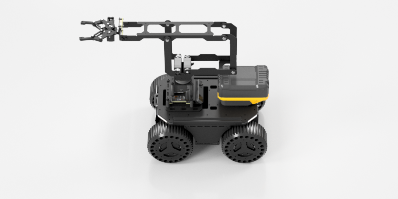
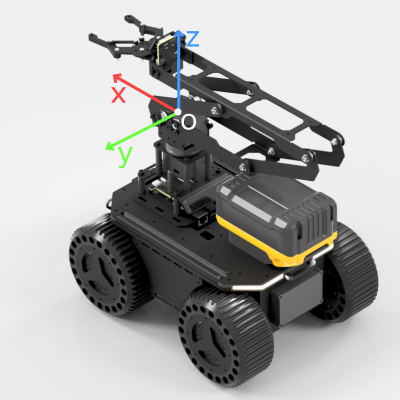

# LinkArm CLI SDK

🌐 Language: English | [中文](./README.md)

A Python command-line tool and SDK for controlling the **LinkArm robotic arm**.

This project provides:

- A **CLI control interface** for end users
- A **Python library API** for developers
- A **standardized control entry** for AI / Agents
- A **quick-start guide** for beginners

It is suitable for:

- Modular debugging
- Educational demonstrations
- Automation scripts
- Raspberry Pi / Jetson robot integration
- Robotic arm control via AI models or agent programs


---

## Table of Contents

- [Overview](#overview)
- [Feature Overview](#feature-overview)
- [System Architecture](#system-architecture)
- [Hardware and Power Supply](#hardware-and-power-supply)
- [Wiring for Different Models](#wiring-for-different-models)
- [Environment Setup](#environment-setup)
- [Connecting the Arm for the First Time](#connecting-the-arm-for-the-first-time)
- [Find the Serial Port and Edit the Config File](#find-the-serial-port-and-edit-the-config-file)
- [Servo Center Calibration (Very Important)](#servo-center-calibration-very-important)
- [Quickly Get the Arm Moving](#quickly-get-the-arm-moving)
- [Configuration File Example](#configuration-file-example)
- [CLI Command Overview](#cli-command-overview)
- [CLI Command Details](#cli-command-details)
- [Interactive Shell Mode](#interactive-shell-mode)
- [Recommendations for AI and Automation Usage](#recommendations-for-ai-and-automation-usage)
- [How to Use This Library in Python Scripts](#how-to-use-this-library-in-python-scripts)
- [Controlling Multiple Arms at the Same Time](#controlling-multiple-arms-at-the-same-time)
- [Getting Started on Different Platforms](#getting-started-on-different-platforms)
- [Calibration Sticker Example on the Arm](#calibration-sticker-example-on-the-arm)
- [Minimal Working Examples](#minimal-working-examples)
- [FAQ](#faq)

---

## Overview

`linkarm.py` serves two roles at the same time:

1. **CLI Tool**  
   Run it directly in the terminal to send commands to control the robotic arm.
2. **Python Library**  
   Import it into your own Python script and instantiate `RobotController`.

This SDK communicates with the robotic arm controller board over a serial connection and supports:

- Joint-space control
- Cartesian inverse kinematics control (IK)
- Forward kinematics reading (FK)
- Gripper control
- Servo torque on/off and torque limiting
- LED control
- PWM output control
- Interactive command line
- JSON output for AI program parsing
- Batch execution of multiple commands

---

## Feature Overview

### Motion Control

- Single-joint control
- Multi-joint synchronized control
- Reliable queued single-joint control
- Cartesian interpolated motion `ik`
- Immediate Cartesian motion `ik-now`
- FPV-style immediate motion `fpv`

### Peripheral Control

- Gripper control `gripper`
- Onboard LED control `led`
- PWM output control `pwm`

### State and Model Capabilities

- Current status reading `status`
- Convert current joint feedback into FK coordinates `fk`

### Configuration and Maintenance

- Servo torque switch `torque-lock`
- Servo torque limit `torque-limit`
- Disable torque on all joints `torque-off-all`
- Record the current center position `set-middle`
- Save center positions to the config file `save-middle`

### Program and AI-Oriented Capabilities

- `--json-output` outputs standard JSON
- `exec "cmd1; cmd2; cmd3"` executes multiple actions in one call
- Interactive shell mode

---

## System Architecture

The LinkArm control system can be understood as 3 layers:

```text
+---------------------------+
|        User Layer         |
|---------------------------|
| Terminal / Scripts / AI   |
+-------------+-------------+
              |
              v
+---------------------------+
|       CLI SDK Layer       |
|---------------------------|
| linkarm.py                |
| - Command parser          |
| - Motion API              |
| - IK / FK                 |
| - Servo control           |
| - LED / PWM               |
+-------------+-------------+
              |
              v
+---------------------------+
|      Hardware Layer       |
|---------------------------|
| Robot Controller Board    |
| Serial communication      |
| Bus servos                |
+---------------------------+
```

The communication path is:

- Host (PC / Raspberry Pi / Jetson)
- USB serial connection
- Robotic arm controller board

---

## Hardware and Power Supply

We currently have two robotic arm models:

- **LinkArm-M**
- **LinkArm-LT**

Both products use:

- **12V DC power**
- A power supply capable of **3A**

They also support:

- **3S lithium battery power**
- Voltage range of approximately **9V ~ 12.6V**

This makes them very suitable for integration into:

- Mobile chassis
- Inspection platforms
- Educational robots
- Teleoperation robots

> Note: The USB cable is mainly used for communication, not for powering the main drive system of the robotic arm.  
> Before use, make sure a proper 12V power supply or 3S lithium battery is connected.

---

## Wiring for Different Models

### LinkArm-M

If you are using **LinkArm-M**:

- Connect the USB cable to the **Type-C port** on **TTL Node (A)**
- Keep the default baud rate in the config file at **500000**
- **No baud-rate change is required**

In other words, normally keep:

```json
"serial_baudrate": 500000
```

### LinkArm-LT

If you are using **LinkArm-LT**:

- Connect the USB cable to the **Type-C port labeled `UART`** on the **Robot Driver board**
- **Do not accidentally plug into the Type-C port labeled `USB`**
- You need to change the baud rate in `arm_config.json` from **500000 to 1000000**

Change:

```json
"serial_baudrate": 500000
```

to:

```json
"serial_baudrate": 1000000
```

---

## Environment Setup

### 1. Install Python

Recommended version:

- Python 3.8 or above

Check the version:

```bash
python --version
```

### 2. Get the Project

```bash
git clone https://github.com/LygionOrganization/linkarm_python_sdk.git
cd linkarm_module
```

### 3. Create a Virtual Environment (Recommended)

#### Windows

```bash
python -m venv venv
venv\Scripts\activate
```

#### Linux / Raspberry Pi / Jetson

```bash
python3 -m venv venv
source venv/bin/activate
```

### 4. Install Dependencies

```bash
pip install -r requirements.txt
```

---

## Connecting the Arm for the First Time

It is recommended to proceed in the following order:

1. Connect a 12V power supply or 3S lithium battery to the robotic arm
2. Use a USB cable to connect the robotic arm to your PC / Raspberry Pi / Jetson
3. Find the serial port number
4. Edit `arm_config.json`
5. Fill in `servo_middle` according to the sticker
6. Run `status` to test communication
7. Test the gripper first, then test IK

---

## Find the Serial Port and Edit the Config File

The SDK reads the following values from `arm_config.json`:

- `default_device_serial_ports`
- `serial_baudrate`

These are used as the default connection parameters.

For example:

```json
{
  "linkarm": {
    "default_device_serial_ports": "COM42",
    "serial_baudrate": 500000
  }
}
```

### Find the Serial Port on Windows

#### Method 1: Device Manager

Open:

- Device Manager
- Ports (COM & LPT)

Find an entry similar to:

```text
USB-Enhanced-SERIAL CH343 (COM42)
```

At that point, the serial port is:

```text
COM42
```

#### Method 2: PowerShell

```powershell
mode
```

### Find the Serial Port on Linux / Raspberry Pi / Jetson

Run the following before and after plugging in the device:

```bash
ls /dev/tty*
```

Common device names:

- `/dev/ttyUSB0`
- `/dev/ttyACM0`

You can also run:

```bash
dmesg | tail
```

or:

```bash
python -m serial.tools.list_ports
```

### Edit the Serial Port in the Config File

Find:

```json
"default_device_serial_ports": "COM42"
```

Change it to your actual serial port.

For example:

#### Windows

```json
"default_device_serial_ports": "COM7"
```

#### Linux / Raspberry Pi / Jetson

```json
"default_device_serial_ports": "/dev/ttyUSB0"
```

> Note: The string must use **standard English double quotes** on both sides.

---

## Servo Center Calibration (Very Important)

This product uses **Feetech SCS series bus servos**.

One important characteristic of this type of servo is:

- **The servo center position cannot be stored inside the servo itself**
- It can only be stored in the `servo_middle` array inside `arm_config.json`

This means:

- **Every robotic arm has different center values**
- When the robotic arm leaves the factory, we print the center-value array for that specific arm on a sticker
- The sticker is attached to that corresponding arm

For example, if the sticker says:

```text
[513,508,327,632]
```

It means the 4 servo center values of this arm are:

- 513
- 508
- 327
- 632

### The User Needs to Manually Edit `arm_config.json`

Find the following in the config file:

```json
"servo_middle": [
  511,
  511,
  511,
  511
]
```

Replace it with the real array from the sticker, for example:

```json
"servo_middle": [
  513,
  508,
  327,
  632
]
```

### This Step Is Extremely Important

If `servo_middle` is filled in incorrectly, it may cause:

- Incorrect FK results
- Inaccurate IK motion
- Shifted arm posture
- Abnormal joint movement directions / ranges
- Inaccurate end-effector position

### Please Pay Special Attention When Editing

- **Do not enter the wrong numbers**
- **You must use English punctuation**
- Use standard square brackets: `[ ]`
- Use standard commas: `,`
- **Do not use Chinese commas `，`**
- Do not omit any numbers

### How to Verify the Center Parameters

When you use `joints 0 0 0 0` to control the robotic arm, its pose should look like the image below:



---

## Quickly Get the Arm Moving

Once you have:

- Connected the power supply
- Connected USB
- Set the correct serial port
- Filled in `servo_middle`
- Set the correct baud rate

you can begin testing.

### 1. Test Status Reading

```bash
python linkarm.py status
```

### 2. Test the Gripper First (Safest)

Note: Even if you only send a gripper-control command, the robotic arm may quickly swing back to its initial position. Before sending motion commands, make sure the center calibration parameters have already been updated, and ensure there are no fragile objects within the working range of the arm. Keep children away.

The robotic arm uses radians for angle control. Specifically for the gripper command, `0` means fully open, and smaller values reduce the opening width. `-1` means fully closed, and the minimum value `-1.5` closes it even tighter. The gripper itself already has torque limiting to avoid servo overheating during long periods of forceful gripping.

Close the gripper:

```bash
python linkarm.py gripper -1
```

Open the gripper:

```bash
python linkarm.py gripper 0
```

### 3. Test a Single-Joint Motion

`--reliable` means this action is treated as a reliable action. Reliable actions are guaranteed to be executed once sent, and they have the highest priority in the action sequence. Actions without this parameter are treated as high-frequency actions and are intended for continuously controlling joint angles from the upper computer. For high-frequency actions, only the latest command is executed.

When you use one-shot CLI commands such as `python linkarm.py`, if you do not add the `--reliable` parameter, the main program may exit before the motion command gets a chance to execute. Therefore, you should add this parameter to indicate that the action must be executed through the reliable action queue.

```bash
python linkarm.py joint 3 -1 --reliable
```

### 4. Test Cartesian Motion of the Robotic Arm

The parameters after `ik-now` represent the `[x, y, z]` coordinates in `mm`. The coordinate axes are defined as shown below:



```bash
python linkarm.py ik-now 250 0 60
```

If the point is within the inverse kinematics workspace, the robotic arm will move to the corresponding position.  
If it is out of range, it will return:

```text
IK_FAILED
```

---

## Configuration File Example

Below is a more complete example of `arm_config.json`. Please modify it according to your actual hardware.

```json
{
  "linkarm": {
    "device_info_keyword": "CH343",
    "default_device_serial_ports": "COM1",
    "serial_baudrate": 500000,
    "joint_type": "scs",
    "joint_id": [
      31,
      32,
      33,
      34
    ],
    "gripper_torque_limit": 200,
    "node_id": 40,
    "servo_middle": [
      511,
      511,
      511,
      511
    ],
    "joint_direction": [
      1,
      1,
      1,
      1
    ],
    "joint_limit": [
      [-1.5708, 1.5708],
      [-1.5708, 1.5708],
      [-0.8, 2],
      [-1.5, 0]
    ],
    "link_ab": 224.0,
    "link_bc": 145.0,
    "link_cd_1": 24.0,
    "link_cd_2": 120.0,
    "link_de": 120.0,
    "link_ef": 25.0,
    "link_bf_1": 24.0,
    "link_bf_2": 120.0
  },
  "joint": {
    "scs": {
      "joint_range_rad": 3.839724777777778,
      "joint_range_steps": 1024,
      "joint_range_angle": 220.0,
      "id_address": 5,
      "torque_limit_address": 16,
      "torque_lock_address": 40
    },
    "hls": {
      "joint_range_rad": 6.28318530718,
      "joint_range_steps": 4096,
      "joint_range_angle": 360.0
    }
  }
}
```

### LinkArm-LT Configuration Difference

If you are using **LinkArm-LT**, please specifically change:

```json
"serial_baudrate": 1000000
```

---

## CLI Command Overview

### One-Shot Command Mode

```bash
python linkarm.py <command> [args]
```

### Main Supported Commands

- `status`
- `joints`
- `joint`
- `gripper`
- `fk`
- `ik`
- `ik-now`
- `fpv`
- `led`
- `pwm`
- `torque-lock`
- `torque-limit`
- `torque-off-all`
- `set-middle`
- `save-middle`
- `cancel-ik`
- `exec`
- `shell`

---

## CLI Command Details

### status

Read the current status:

```bash
python linkarm.py status
```

### joints

Synchronized multi-joint control:

```bash
python linkarm.py joints 0 0.2 -0.3 0
```

With speed and acceleration:

```bash
python linkarm.py joints 0 0.2 -0.3 0 --speed 200 --acc 50
```

### joint

Single-joint control:

```bash
python linkarm.py joint 1 0.3
```

Reliable queue mode:

```bash
python linkarm.py joint 3 -1 --reliable
```

> For low-frequency actions that must not be dropped, such as gripper-related motions, it is recommended to prefer `--reliable` or `gripper`.

### gripper

Gripper control:

```bash
python linkarm.py gripper -1
python linkarm.py gripper 0
```

### ik

Cartesian interpolated motion:

```bash
python linkarm.py ik 250 0 60
```

### ik-now

Immediate Cartesian motion:

```bash
python linkarm.py ik-now 250 0 60
```

### fpv

FPV-style control:

This control mode is mainly used when a camera is installed at the end of the robotic arm. When controlling the arm from a first-person perspective, this control mode is more intuitive.

- The first parameter is the rotation angle of the base, in radians.
- The second parameter is the forward extension distance of the end point, in mm.
- The third parameter is the height of the end point, in mm.

```bash
python linkarm.py fpv 1.0 250 60
```

### led

Control the onboard LED color. Parameter range: `0 ~ 8`.

- The first parameter is the R-red channel. The larger the value, the brighter that channel.
- The second parameter is the G-green channel. The larger the value, the brighter that channel.
- The third parameter is the B-blue channel. The larger the value, the brighter that channel.

```bash
python linkarm.py led 8 0 0
python linkarm.py led 0 8 0
python linkarm.py led 0 0 8
python linkarm.py led 8 8 8
```

### pwm

Control the PWM output. Currently supported channels:

- `0`
- `1`

PWM values support `0~1024`, corresponding to `0~100%` PWM, and are used to control the output voltage of the switching interface. 100% PWM means the switching port outputs the bus supply voltage. Users can use this interface to control DC devices such as LED fill lights, electromagnets, and solenoid valves. However, please note that PWM and output voltage are not perfectly linearly related.

For example:

```bash
python linkarm.py pwm 0 500
python linkarm.py pwm 1 1025
```

### torque-lock

Servo torque switch:

- The first parameter is the servo ID.
- The second parameter: `1` means torque output enabled; `0` means torque output disabled.

```bash
python linkarm.py torque-lock 31 1
python linkarm.py torque-lock 31 0
```

### torque-limit

Set the torque limit for a specific servo:

- The first parameter is the servo ID.
- The second parameter is the maximum torque. `1000` means no torque limit, and `200` means limiting max torque to 20%.

```bash
python linkarm.py torque-limit 34 200
```

### torque-off-all

Disable torque on all joints:

After torque is disabled on all joints, you can manually adjust the arm pose by hand.

```bash
python linkarm.py torque-off-all
```

### set-middle

Record the current feedback position as the in-memory `servo_middle`:

```bash
python linkarm.py set-middle
```

### save-middle

Save the current in-memory `servo_middle` into `arm_config.json`:

```bash
python linkarm.py save-middle
```

### cancel-ik

Cancel the current interpolated IK task:

```bash
python linkarm.py cancel-ik
```

### exec

Execute multiple commands at once:

```bash
python linkarm.py exec "gripper -1; sleep 1; gripper 0; ik-now 250 0 60"
```

### --json-output

Output standard JSON for program parsing:

```bash
python linkarm.py --json-output status
python linkarm.py --json-output fk
python linkarm.py --json-output exec "status; fk; gripper -1"
```

---

## Interactive Shell Mode

If you want to continuously enter commands, you can enter shell mode:

```bash
python linkarm.py shell
```

You can also run directly:

```bash
python linkarm.py
```

After entering, you can input:

```text
status
gripper -1
sleep 1
gripper 0
ik 250 0 60
fk
led 8 0 0
pwm 0 500
exit
```

---

## Recommendations for AI and Automation Usage

If you want AI models, Agents, or other programs to control the robotic arm, it is recommended to use:

- `--json-output`
- `exec`

For example:

```bash
python linkarm.py --json-output status
```

You can also use:

```bash
python linkarm.py --json-output exec "status; fk; gripper -1; sleep 1; gripper 0"
```

### Recommended AI Usage Strategy

1. Read `status` first
2. Prefer `gripper` for gripper actions
3. Prefer `ik-now` for immediate positioning
4. Use `ik` for smooth motion
5. Use `fk` to verify the end-effector position

---

## How to Use This Library in Python Scripts

In addition to the CLI, you can also directly import and control the robotic arm in Python scripts.

### Simplest Usage

```python
from linkarm import RobotController
import time

with RobotController(
    config_path="arm_config.json",
    communication_mode="direct_servo",
) as arm:
    print(arm.get_latest_feedback())
    arm.gripper_ctrl(-1)
    time.sleep(1)
    arm.gripper_ctrl(0)
```

### Joint Control Example

```python
from linkarm import RobotController

with RobotController(
    config_path="arm_config.json",
    communication_mode="direct_servo",
) as arm:
    arm.move_joint_rad(1, 0.3, speed=100, acc=50, blocking=False)
    arm.move_joints_rad_sync([0.0, 0.2, -0.3, 0.0], speed=200, acc=50, blocking=True)
```

### Reliable Queue Single-Joint Control

```python
from linkarm import RobotController
import time

with RobotController(
    config_path="arm_config.json",
    communication_mode="direct_servo",
) as arm:
    arm.move_joint_rad_reliable(3, -1.0, speed=100, acc=50)
    time.sleep(1)
    arm.move_joint_rad_reliable(3, 0.0, speed=100, acc=50)
```

### IK Control Example

```python
from linkarm import RobotController
import time

with RobotController(
    config_path="arm_config.json",
    communication_mode="direct_servo",
) as arm:
    arm.ik_ctrl([250, 0, 60, 0.0], speed=880)
    time.sleep(2)
```

### Immediate Motion Example

```python
from linkarm import RobotController

with RobotController(
    config_path="arm_config.json",
    communication_mode="direct_servo",
) as arm:
    ok = arm.ik_ctrl_immediate([250, 0, 60, 0.0])
    print("IK result:", ok)
```

### FK Reading Example

```python
from linkarm import RobotController

with RobotController(
    config_path="arm_config.json",
    communication_mode="direct_servo",
) as arm:
    xyz = arm.get_fk_result()
    print("FK:", xyz)
```

### Lighting and PWM Control Example

```python
from linkarm import RobotController
import time

with RobotController(
    config_path="arm_config.json",
    communication_mode="direct_servo",
) as arm:
    arm.set_led_async(8, 0, 0)
    time.sleep(1)
    arm.set_led_async(0, 8, 0)
    time.sleep(1)
    arm.set_pwm_async(0, 500)
```

### Torque Control Example

```python
from linkarm import RobotController
import time

with RobotController(
    config_path="arm_config.json",
    communication_mode="direct_servo",
) as arm:
    arm.torque_lock_ctrl(31, 0)
    time.sleep(1)
    arm.torque_lock_ctrl(31, 1)
    arm.torque_limit(34, 200)
```

### Center Calibration Example

```python
from linkarm import RobotController
import time

with RobotController(
    config_path="arm_config.json",
    communication_mode="direct_servo",
) as arm:
    arm.torque_off_all_joint()
    time.sleep(1)

    middle = arm.set_arm_middle_as_current_pos()
    print("servo_middle =", middle)

    arm.save_joint_middle()
```

---

## Controlling Multiple Arms at the Same Time

If you want to control multiple robotic arms at the same time, you do not need to modify the main SDK body. You only need to:

1. Copy multiple `arm_config.json` files
2. Change them to different names, for example:
   - `arm_config_1.json`
   - `arm_config_2.json`
3. Fill in each robotic arm separately with:
   - Different serial ports
   - Different `servo_middle`

For example:

### arm_config_1.json

```json
{
  "linkarm": {
    "default_device_serial_ports": "COM7",
    "servo_middle": [513, 508, 327, 632]
  }
}
```

### arm_config_2.json

```json
{
  "linkarm": {
    "default_device_serial_ports": "COM8",
    "servo_middle": [512, 510, 330, 629]
  }
}
```

Then instantiate them separately in Python scripts:

```python
from linkarm import RobotController

arm1 = RobotController(config_path="arm_config_1.json", communication_mode="direct_servo")
arm2 = RobotController(config_path="arm_config_2.json", communication_mode="direct_servo")

arm1.move_joint_rad(1, 0.2)
arm2.move_joint_rad(1, -0.2)
```

---

## Getting Started on Different Platforms

### Windows

1. Install Python
2. Install the CH343 driver (in most cases it is installed automatically)
3. Open Device Manager and confirm the COM port
4. Modify `default_device_serial_ports` in `arm_config.json`
5. Modify `servo_middle` according to the sticker
6. Run:

```bash
python linkarm.py status
python linkarm.py gripper -1
python linkarm.py ik-now 250 0 60
```

### Raspberry Pi

1. Install Python 3
2. Connect the robotic arm via USB
3. Use `ls /dev/tty*` or `python -m serial.tools.list_ports` to find the serial port
4. Modify `arm_config.json`
5. Run:

```bash
python3 linkarm.py status
python3 linkarm.py gripper -1
python3 linkarm.py ik-now 250 0 60
```

### Jetson

1. Install Python 3
2. Connect the robotic arm via USB
3. Check serial-port permissions
4. Modify `arm_config.json`
5. If it is LinkArm-LT, confirm that the baud rate is `1000000`
6. Run:

```bash
python3 linkarm.py status
python3 linkarm.py gripper -1
python3 linkarm.py ik-now 250 0 60
```

---

## Calibration Sticker Example on the Arm

After the product reaches the user, first check the sticker attached to the robotic arm body.

For example, the sticker may say:

```text
servo_middle:
[513,508,327,632]
```

Then open `arm_config.json` and find:

```json
"servo_middle": [
  511,
  511,
  511,
  511
]
```

Replace it with:

```json
"servo_middle": [
  513,
  508,
  327,
  632
]
```

Recommended workflow:

1. Check the sticker first
2. Then check the serial port
3. Finally check the baud rate
4. After that, run `status` first
5. Then run `gripper` and `ik-now`

---

## Minimal Working Examples

### Example 1: CLI Only

```bash
python linkarm.py status
python linkarm.py gripper -1
python linkarm.py gripper 0
python linkarm.py ik-now 250 0 60
```

### Example 2: Batch Actions

```bash
python linkarm.py exec "gripper -1; sleep 1; gripper 0; ik-now 250 0 60; fk"
```

### Example 3: JSON Output for Program Parsing

```bash
python linkarm.py --json-output exec "status; fk; gripper -1"
```

### Example 4: Minimal Python Control Script

```python
from linkarm import RobotController
import time

with RobotController(
    config_path="arm_config.json",
    communication_mode="direct_servo",
) as arm:
    print("Feedback:", arm.get_latest_feedback())
    print("FK:", arm.get_fk_result())

    arm.gripper_ctrl(-1)
    time.sleep(1)
    arm.gripper_ctrl(0)

    ok = arm.ik_ctrl_immediate([250, 0, 60, 0.0])
    print("IK OK:", ok)
```

---

## FAQ

### The Robotic Arm Does Not Move

Please check:

- Whether the 12V power supply is properly connected
- Whether the power supply can provide 3A
- Whether the USB cable is connected to the correct port
- Whether the serial port is correct
- Whether the baud rate is correct
- Whether `servo_middle` has been correctly filled in according to the sticker

### LinkArm-LT Connects Normally but Does Not Respond

Please check the following first:

- Whether the USB cable is connected to the Type-C port labeled **UART**
- Whether it was mistakenly connected to the Type-C port labeled **USB** on the board
- Whether `serial_baudrate` has been changed to `1000000`

### IK_FAILED

This means the target position is outside the IK workspace or is unreachable.

You can first try a more conservative target point, for example:

```bash
python linkarm.py ik-now 200 0 60
```

### FK Results Are Obviously Incorrect

Check the following first:

- Whether `servo_middle` is correct
- Whether you accidentally filled in the sticker data from another robotic arm
- Whether Chinese punctuation was mistakenly entered in the JSON file

### Cannot Find the Serial Port

#### Windows

- Check the COM port in Device Manager
- Try another USB data cable
- Install the CH343 / CH340 driver

#### Linux / Raspberry Pi / Jetson

- Check `/dev/ttyUSB0` / `/dev/ttyACM0`
- Run `dmesg | tail`
- Confirm that the current user has serial-port permissions

### How to Check Which CLI Commands Are Currently Supported

```bash
python linkarm.py --help
```

Or enter shell mode and type:

```text
help
```

---

## License

```text
MIT License
```

---

## For Developers

If you want to integrate this SDK into:

- GUI control interfaces
- Web control interfaces
- ROS2 nodes
- AI Agents
- Cloud scheduling systems

it is recommended to reuse the `RobotController` interface layer first, rather than directly operating the underlying serial logic.
